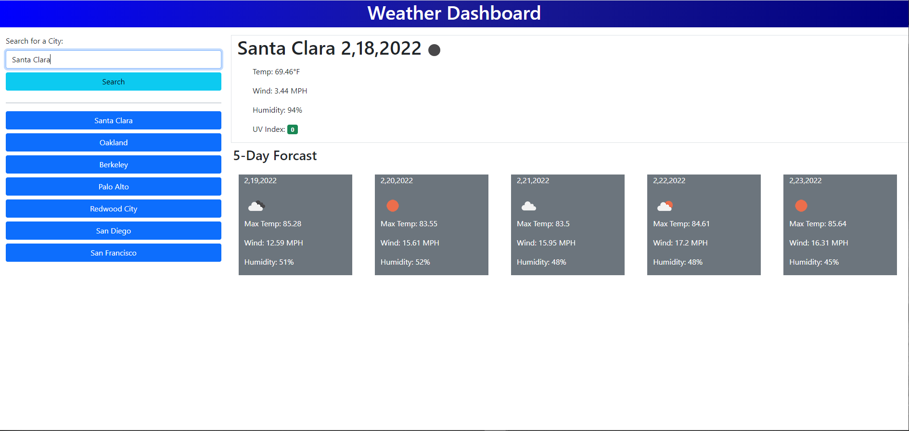
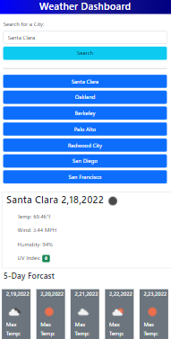
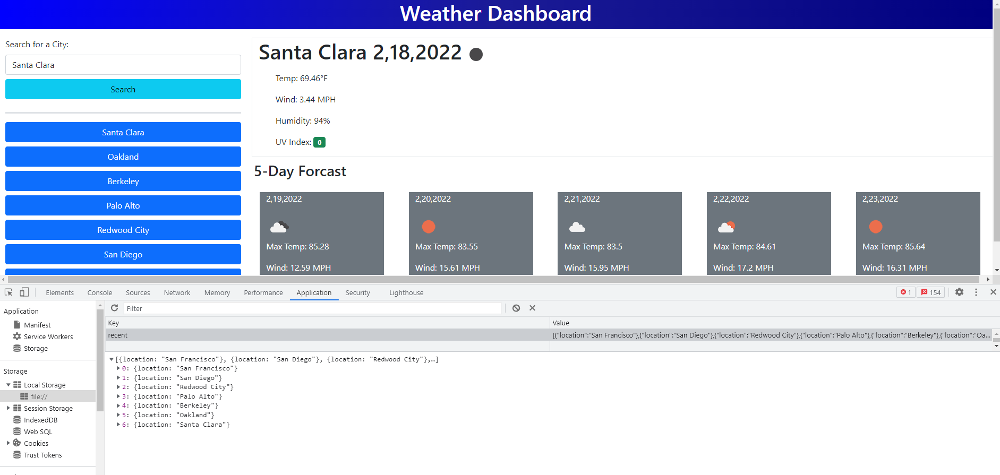

# weather-dashboard

Hello World!!!

Welcome to my Weather Dashboard. This application is built using HTML, CSS, Javascript, Bootstrap for styling, jQuery, and the Open Weather One API for data. Users can input a city in the text box and search for current weather data and a five-day forcast! 

Whether on desktop or mobile, the weather-dashboard presents a clean UI and simple functionality. Previous searches are included below the search box, and appear as buttons that the user can click to open the data for that city! User input is saved between browser refresh so it is simple to look up your home town's weather forcast. Please give the weather dashboard a try!

Enjoy!

 
 